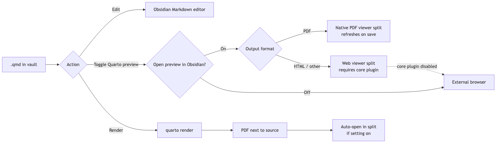
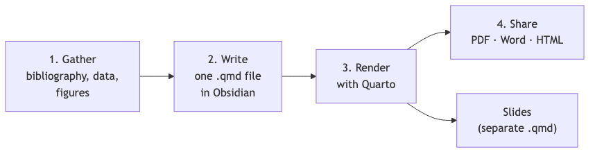

# qmd as md

A plugin for [Obsidian](https://obsidian.md) that allows seamless editing of QMD files as if they were Markdown, plus rendering and live preview of `.qmd` files directly inside Obsidian via Quarto. `.md` files inside a Quarto project (folder with `_quarto.yml`) can also be rendered and previewed — opt-in via settings.

QMD files combine Markdown with executable code cells and are supported by [Quarto](https://quarto.org/), an open-source publishing system. They work in editors like RStudio and VSCode and  might be compiled to target format files via pandoc. For format-specific options (PDF, HTML, DOCX, reveal.js, etc.), see the [Quarto format reference](https://quarto.org/docs/reference/).

This plugin shells out to the `quarto` CLI for all preview and render operations, so Quarto must be installed locally and reachable on your shell `PATH`; if it is not auto-discovered, set its full path in **Settings → qmd as md → Quarto path** (e.g. `/usr/local/bin/quarto`).

## Features

- View and edit `.qmd` files using Obsidian's standard Markdown editor.
- **Create a new `.qmd` from a built-in preset** (empty, Word `.docx`, or modern Typst PDF) via the command palette. *(Since 0.4.)*
- Run Quarto preview on the current file, shown inside Obsidian or in your browser.
- Render to PDF and (optionally) open the result inside Obsidian.
- A sidebar **outline** of the active `.qmd` file's headings — Obsidian's core Outline panel cannot read `.qmd` files.
- Optionally run the preview and render commands on `.md` files too, when they live inside a Quarto project (a folder with `_quarto.yml`).
- Optional dedicated editor for `.yml` / `.yaml` files, with Quarto-oriented YAML syntax highlighting.
- Optional dedicated editor for `.lua` files with minimal syntax highlighting — handy for Quarto/pandoc filter scripts.
- Quarto errors surface as Obsidian notices, not just in the developer console.
- [Obsidian callouts rendered as native Quarto callouts](#obsidian-callouts-in-quarto-output) via a small pandoc Lua filter.

## Usage

In short: The diagram below sketches the three things you do with a `.qmd` file in the vault — **edit**, **preview**, **render**. Editing happens in Obsidian's standard Markdown editor. **Toggle Quarto preview** spawns a live `quarto preview` server that re-renders on save; depending on the output format and the **Open Quarto preview in Obsidian** setting, it lands in the native PDF viewer, the Web viewer split, or your external browser. **Render** runs a one-shot `quarto render`, drops the PDF next to the source, and (with the **Open Compiled PDF in Obsidian** setting on) opens it in a right split. The sections below cover each path in detail.



**Quarto for academics**

Quarto suits academic work especially well because one `.qmd` can render a journal-ready PDF, a `.docx`, or an HTML version of the same manuscript. A separate `.qmd` (typically reusing the same bibliography and figures) drives the talk as PDF or reveal.js slides — manuscript and presentation stay in their own files, not one document juggling both formats. Citations use pandoc's `citeproc` against a `.bib` file — Zotero (with [Better BibTeX](https://retorque.re/zotero-better-bibtex/) for auto-export) plus Obsidian plugins like [Citations](https://github.com/hans/obsidian-citation-plugin) or [Pandoc Reference List](https://github.com/mgmeyers/obsidian-pandoc-reference-list) let you insert `@key` references while drafting in the vault. On top of that Quarto gives cross-references, equations, and reproducible Python/R analyses in the same document. See [Quarto in academia](#quarto-in-academia) below for a workflow sketch and pointers to the official docs.

### Editing QMD files

Once installed, `.qmd` files open in Obsidian's Markdown editor automatically.

To enable linking with Quarto files, ensure the **"Detect all file extensions"** toggle is activated in the `Files & Links` section of Obsidian settings.

### Quarto preview

Available from the command palette: run **Toggle Quarto preview** on the active `.qmd` file. *(Since 0.0.3.)*

### Rendering to PDF

*(Since 0.1)*

Three command-palette entries (all share the ribbon icon `file-output`, which is bound to the YAML-driven variant):

| Command | What it runs | When to use |
|---------|--------------|-------------|
| **Render Quarto (use format defined in YAML)** | `quarto render <file>` | Document's YAML `format:` block decides the output. If YAML targets a non-PDF format (e.g. `html`, `docx`), the file still renders but Obsidian's built-in viewer will not open it — the plugin shows a path notice. |
| **Render Quarto to PDF (Typst engine)** | `quarto render <file> --to typst` | Force the Typst engine regardless of YAML. Use `QUARTO_TYPST` setting to pin a Typst binary. |
| **Render Quarto to PDF (LaTeX engine)** | `quarto render <file> --to pdf` | Force the LaTeX engine (`lualatex`/`xelatex`/`pdflatex`). |

The CLI flag `--to pdf` is **Quarto's LaTeX path**, not a generic "any PDF" — that's why the engine-specific commands are split out. Pick the YAML-driven one if your `.qmd` already declares the format you want; pick an explicit engine to override per-render without touching the file.

If a live preview is running for the file, triggering any render stops that preview first — a one-shot `quarto render` and a running `quarto preview` would otherwise fight over the same output paths.

When a render fails, the notice shows Quarto's actual `ERROR:` line (bad YAML, missing engine, etc.), so you usually don't need to open the developer console.

#### Setting: Open Compiled PDF in Obsidian

Off by default.

- **Off** — render finishes, notice shows the PDF path. Open it however you want.
- **On** — rendered PDF opens in a vertical split on the right via Obsidian's built-in PDF viewer. Source tab keeps focus.

Re-running the render reuses the existing PDF tab — no tab stacking.

#### Caveats

- The `.qmd` source must live inside the vault (the rendered `.pdf` lands next to it; Obsidian only opens vault files).
- Custom `output-dir` in `_quarto.yml` is not yet handled — the plugin looks for `<basename>.pdf` next to the source.

### Live preview

*(Since 0.2.)*

The **Toggle Quarto preview** command (palette + ribbon icon `eye`) spawns `quarto preview` on the active `.qmd`, which runs a live HTTP server that re-renders on every save.

Setting **Open Quarto preview in Obsidian** decides where the generic command and ribbon preview land:

- **On** (default):
  - **PDF outputs** (e.g. `format: typst`, `format: pdf`) open in Obsidian's **native PDF viewer** in a right split. Each compile from the running preview refreshes the same tab — no Quarto-served PDF.js wrapper page. The HTTP server keeps running in the background, but the URL is not opened; instead, a notice reports the server URL for reference.
  - **Non-PDF outputs** (HTML, etc.) open in Obsidian 1.8's built-in `webviewer` view. Requires the **Web viewer** core plugin to be enabled (Settings → Core plugins). The preview re-renders in place as you save the source.
- **Off**: the plugin opens Quarto's preview URL in your default external browser.

Two explicit command-palette entries bypass the setting:

- **Toggle Quarto preview in Obsidian** always uses the in-app target.
- **Toggle Quarto preview in external browser** always opens your default browser.

If the Web viewer core plugin is disabled while the Obsidian target is used for a non-PDF preview, the plugin shows a notice and falls back to your external browser instead of silently failing.

Either way, the underlying `quarto preview` process keeps running until you toggle the command again (or trigger a render) — the toggle controls where the output is shown, not the server's behaviour. Stopping the preview kills the whole Quarto process tree, including the background HTTP server, so it does not keep serving after you stop it.

Preview errors — including errors from a recompile while the preview is running — are reported as notices showing Quarto's `ERROR:` line.

### Quarto outline

*(Since 0.2.)*

Obsidian's core **Outline** panel only reads `.md` files, so it stays blank for `.qmd`. This plugin adds its own outline instead.

Turn on **Show Quarto outline** in settings, or run the **Open Quarto outline** command, to open a sidebar listing the headings of the active `.qmd` file. Click a heading to jump to it in the editor.

- Active file only — headings from files pulled in with `` are not listed.
- ATX headings (`#`, `##`, …) only; setext (underlined) headings are not shown.
- Headings inside YAML frontmatter and fenced code cells are ignored.

### Markdown files in Quarto projects

*(Since 0.3.)*

Setting **Preview and render Markdown files with Quarto** is off by default. Turn it on to let the preview and render commands also accept `.md` files — but only when those files live inside a Quarto project, i.e. a `_quarto.yml` exists in the file's folder or any ancestor folder up to the vault root. Plain `.md` notes outside a Quarto project are left untouched.

### YAML file editor

*(Since 0.3.)*

Setting **Show YAML files** is off by default. Turn it on to make `.yml` and `.yaml` files — including `_quarto.yml` — visible and editable inside Obsidian, in a dedicated CodeMirror editor with Quarto-oriented YAML syntax highlighting.

### Lua file editor

*(Since 0.3.2.)*

Setting **Show Lua files** is off by default. Turn it on to make `.lua` files visible and editable inside Obsidian, in a dedicated CodeMirror editor with minimal Lua syntax highlighting (comments, strings, numbers, keywords) — handy for editing Quarto/pandoc filter scripts without leaving Obsidian.

### Creating a new QMD file

*(Since 0.4.)*

Run **New Quarto file from preset** in the command palette. Pick a preset, enter a filename, and the new `.qmd` is created in the active folder (or vault root if none is active) and opened immediately. Existing files are never overwritten — name collisions get a `-1`, `-2`, … suffix.

**Built-in presets** (always available):

- *Empty* — minimal front-matter, no format specified.
- *Word (.docx)* — `format: docx` with TOC and numbered sections.
- *Typst PDF — Notes (Eisvogel-style)* — A4, numbered sections, page header, boxed code, accent rule under H1s.
- *Typst PDF — Report (Eisvogel-style)* — adds cover metadata, TOC, bibliography/CSL hints; same Typst styling block.

**Your own templates (optional).** Set **Settings → qmd as md → Templates folder** to any folder in your vault (e.g. `_quarto-templates`). Every top-level `.qmd` file inside that folder is offered as a preset alongside the built-ins; the file name becomes the preset name, the file contents are inserted into the new file verbatim. Subfolders are ignored. Leave the setting empty (the default) to show only the built-ins.

Because templates are real `.qmd` files in your vault, you edit them with Obsidian's normal editor, version-control them with the rest of your vault, and copy them between vaults like any other note. The built-ins are starting points: copy any built-in into your templates folder, tweak it, and your version takes priority in the picker.

### Obsidian callouts in Quarto output

Quarto does not understand Obsidian's callout syntax (`> [!note]`) out of the box — it renders them as plain blockquotes. A small pandoc Lua filter bridges the gap, turning them into native Quarto callouts.

1. Save [`obsidian-callouts.lua`][callouts-filter] into your Quarto project (next to `_quarto.yml` is fine).
2. Add it to `_quarto.yml` — you can edit that file right inside Obsidian with the YAML file editor above:

   ```yaml
   filters:
     - obsidian-callouts.lua
   ```

Now a callout written in Obsidian:

```markdown
> [!note] My title
> body text
```

renders as a proper Quarto callout (`note`/`tip`/`warning`/`caution`/`important`, with title and `-`/`+` fold state) in HTML, PDF, and other formats. Requires Quarto ≥ 1.3.

[callouts-filter]: https://gist.github.com/danieltomasz/31d298aca2969adaf60d8841b68005e2

## Quarto in academia

A typical Quarto writing project follows four steps: **gather** your bibliography (e.g. exported from Zotero), data and figures; **write** a single `.qmd` in your Obsidian vault; **render** it with Quarto; and **share** the result as PDF, Word, HTML, or — from a separate `.qmd` — slides. Quarto's own [Get Started](https://quarto.org/docs/get-started/) and [authoring guide](https://quarto.org/docs/authoring/markdown-basics.html) cover the syntax in depth; see also the [citations](https://quarto.org/docs/authoring/citations.html) and [cross-references](https://quarto.org/docs/authoring/cross-references.html) pages.



For using more fancy templates, check various blogposts,  [quarto-academic-typst](https://github.com/kazuyanagimoto/quarto-academic-typst) extension is one of the   good starting points — a Typst-based template for papers and preprints with clean typography, author/affiliation blocks, and BibTeX citation support. Install per-project with `quarto add kazuyanagimoto/quarto-academic-typst`, then set `format: academic-typst-pdf` in your YAML. Typst compiles much faster than LaTeX and needs no TinyTeX install. Combine with Quarto's `bibliography:` + `csl:` fields for reference management, and keep figures/data in the same vault folder so Obsidian's graph view stays useful.

> [!note] Picking the Python / R distribution
> **Planned for a future release:** plugin settings to point Quarto at a specific Python or R install (likely exposed as `QUARTO_PYTHON` / `QUARTO_R` env vars injected at compile time). Until then the plugin shells out to whatever `quarto` finds on `PATH`.
>
> **Python (jupyter engine):** register the env as a Jupyter kernel (`python -m ipykernel install --user --name myenv`) and pin it in YAML with `jupyter: myenv`. Alternatively set `QUARTO_PYTHON` in your shell before launching Obsidian.
>
> **R (knitr engine):** no YAML field selects the R binary — set `QUARTO_R=/path/to/Rscript` (or fix `PATH`) before launching Obsidian.
>
> Verified against Quarto 1.9.

## Alternatives

As of the end of 2024, there are also other plugins that make it easier to work with Obsidian and Quarto:

- [Ridian](https://github.com/MichelNivard/Ridian) offers R code block execution and variable previews.
- [Quarto Exporter](https://github.com/AndreasThinks/obsidian-to-quarto-exporter) helps export Obsidian Markdown files into the QMD format.

The main difference between this plugin and these other plugins is that this plugin allows you to compile QMD files as they are, without exporting them to another folder. In this regard, it is more similar to the Pandoc plugin.

## Installation

### From the community plugin store (stable)

Search for **qmd as md** in **Settings → Community plugins → Browse**. The community-store version always tracks the latest **stable** release (currently `0.3.0`).

### Beta releases via BRAT

Pre-release versions (`-rc.x`, `-beta.x`) are **only** distributed through [BRAT](https://github.com/TfTHacker/obsidian42-brat). The community plugin store will not show them.

1. Install **Obsidian42 - BRAT** from the community plugins list.
2. Open BRAT settings → use **Add Beta plugin** (the "frozen version" option is not needed).
3. Enter the repo: `danieltomasz/qmd-as-md-obsidian`.
4. BRAT reads `manifest-beta.json` from the repo and installs the latest pre-release tag (e.g. `0.2.0-rc.8`).
5. Enable the plugin in **Settings → Community plugins**.

To switch back to stable, remove the plugin from BRAT and reinstall from the community store.

### Manual install from GitHub

1. Download the latest release from the Releases section of the GitHub repository.
2. Extract the plugin folder from the zip file to your vault's plugins directory: `<vault>/.obsidian/plugins/`
   - Note: On some systems, the `.obsidian` folder might be hidden. On macOS, press `Command + Shift + Dot` to reveal hidden folders in Finder.
3. Reload Obsidian.
4. If prompted about Safe Mode, disable it and enable the plugin. Alternatively, go to **Settings → Third-party plugins**, disable Safe Mode, and enable the plugin manually.

## Hiding clutter from Quarto projects

If you'd like to hide additional file types, use the following CSS snippet. Save it in your snippets folder and enable it via the Appearance menu in Obsidian. You can add more file extensions as needed.

```css
div[data-path$='.Rproj'] {
 display: none;
}

div[data-path$='.cls'] {
 display: none;
}

div[data-path$='.yml'] {
 display: none;
}

div[data-path$='.json'] {
 display: none;
}
```

## Roadmap

- [x] Use Obsidian 1.8's web preview to enable seamless in-app previews. *(Shipped in 0.2.0 — toggle in settings.)*
- [x] Show an outline of `.qmd` headings. *(Shipped in 0.2.0 — toggle in settings.)*
- [ ] Recognize `{language}` for code block syntax highlighting.
- [ ] Add CSS support for callout blocks.
- [x] Enable the creation of new QMD files.
- [ ] Resolve headings from `` files in the outline.
- [x] Add a render command. *(Shipped in 0.1.0.)*

## Compatibility

This plugin requires Obsidian **v1.8.0** or later — the in-app preview relies on the Web viewer core plugin introduced in that version. It is **desktop only**: Quarto runs as an external process, which is not available on mobile.

## Security

> **Important:** Third-party plugins can access files on your computer, connect to the internet, and install additional programs.

The source code for this plugin is open and available on GitHub for audit. While I assure you that the plugin does not collect data or perform any malicious actions, installing plugins in Obsidian always involves a level of trust.

## Changelog & contributing

This plugin originated in 2022 as a minimal change to a now-archived project by deathau: [deathau/txt-as-md-obsidian](https://github.com/deathau/txt-as-md-obsidian). It has since evolved to include additional integrations and features.

- See [`Changelog.md`](./Changelog.md) for the full version history.
- See [`Contributing.md`](./Contributing.md) for development setup, the `make` targets, and the release process.
